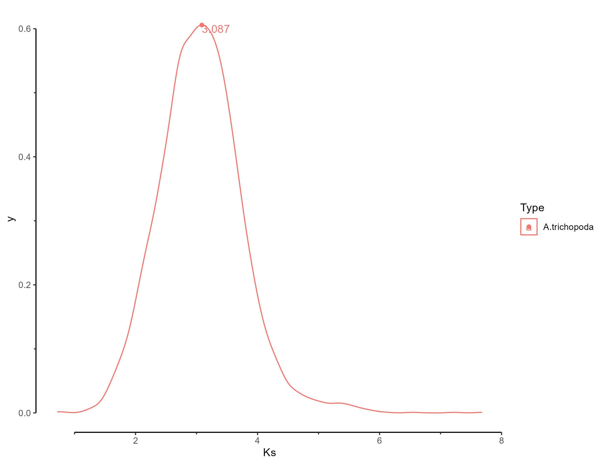

## demo for use KK4D
download demo data from https://doi.org/10.6084/m9.figshare.25060220.v1.
## Input file list

- Ath.genome.fa.gz 
- Ath.gff3.gz 
- IRGSP.cds.fa.gz 
- IRGSP.pep.fa.gz 
- IRGSPRAP.gff3.gz

## From genome file get the protein and CDS sequence files for Arabidopsis
```
gzip -d Ath.genome.fa.gz 
gzip -d Ath.gff3.gz 
bash genome2cdspep.sh Ath.genome.fa Ath.gff3 Ath .
```
This will output the file `Ath.pep` and `Ath.cds`.

**Please remember that each new analysis of a different genome must be in a new folder, otherwise it may cause errors.**
## example1:Comparative analysis of one genomes. (Arabidopsis thaliana)
```
mkdir Ath_result
cd Ath_result
mv ../Ath.pep .
mv ../Ath.cds .
mv ../Ath.gff3 .
KK4D.sh all -group 1 -cpu 24 -key ID -type mRNA -sample A.thaliana -abbr Ath -gff3 Ath.gff3 -protein Ath.pep -cds Ath.cds -chrnum 5
```
24 CPU threads were used above
### output file list


<center>Ath.Ath.dotplot.pdf</center>

<center>A.thaliana.A.thaliana.sankey.pdf</center>

<center>ks_4DTv.bold.jpg</center>

<center>Ath_Ath.block.coline.pdf</center>

- Ath_Ath.homolog 
- All.Ks_peak.csv 
- All.X4dtv_corrected_peak.csv 
- Ath_Ath.kaks4DTv.csv 

<center>All.Ks_peak.csv </center>

|x|y|peak_time|type|peak_type|
|---|---|---|---|---|
|0.047947329|0.005494129|2.715024274|A.thaliana|Ks|
|**0.906953311**|1.082462082|**51.35635961**|A.thaliana|Ks|
|2.407495406|0.11673559|136.3247682|A.thaliana|Ks|

Combined with the Ks distribution chart drawn above, it can be seen that the line in black font in the table is the correct peak value. The x value in this row means that the peak Ks is 0.906953311, and the following peak_time 51.35635961 indicates that the doubling of the Arabidopsis genome occurred at 51.35635961MYA (millions of years ago).

*Ks peak and 4DTv peak file, please note that there may be redundant peaks in it, and users need to judge by themselves which are the final valid peaks.* 
The default evolutionary rate λ is 7E-9. If you need to change the value of λ, you can calculate the time of your species according to the formula T=(Ks_peak/2λ). For example, if you need to change λ to 2.5e-9, then You can use T=0.906953311/(2*(2.5e-9))/(1E6) to get T=181.39066219 MYA.


## example2:Comparative analysis of two genomes. (Arabidopsis thaliana and rice IRGSP1.0)
```
mkdir Ath_rice
cd Ath_rice
mv ../Ath.pep .
mv ../Ath.cds .
mv ../Ath.gff3 .
mv ../IRGSP.cds.fa.gz .
mv ../IRGSP.pep.fa.gz .
mv ../IRGSPRAP.gff3.gz .
KK4D.sh all -wd /pathto/Ath_rice -group 2 -cpu 32 -key ID ID -type mRNA mRNA -sample A.thaliana Oryza.Sativa -abbr Ath Osa -gff3 Ath.gff3 IRGSPRAP.gff3.gz -protein Ath.pep IRGSP.pep.fa.gz -cds Ath.cds IRGSP.cds.fa.gz -chrnum 5 12
```
### output file list

<center>A.trichopoda.Oryza.Sativa.sankey.pdf</center>


<center>Ath.Osa.pdf</center>


<center>Ath_Osa.bar.plot.pdf</center>


<center>Ath_Osa.block.coline.pdf</center>


<center>ks_4DTv.bold.pdf</center>


<center>Ks_new.peak.png</center>


<center>X4dtv_corrected_new.peak.png</center>


<center>Ath_Osa.kaks4DTv.csv</center>

|Seq|4dtv_corrected|Ka|Ks|Ka/Ks|
|---|---|---|---|---|
|AT1G01340-Os06t0527100-01|	0.517241379|0.325955|3.27552|0.0995124|
|AT1G01360-Os06t0526400-00|	0.422222222|0.350108|3.14752|0.111233|
|AT1G01430-Os06t0524400-01|	0.482352941|0.47486|2.78177|0.170704|
|AT1G01440-Os06t0524300-01|	0.444444444|0.713729|2.12416|0.336005|
|AT1G01490-Os03t0126700-01|	0.45|0.314753|3.76469|0.0836064|
|AT1G01490-Os10t0532300-01|	0.303030303|0.359687|3.56672|0.100845|
|...|...|...|...|...|


<center>All.Ks_peak.csv</center>

|x|y|peak_time|type|peak_type|
|---|---|---|---|---|
|3.087357756|0.605837178|257.279813|A.trichopoda|Ks|

<center>All.X4dtv_corrected_peak.csv</center>

|x|y|peak_time|type|peak_type|
|---|---|---|---|---|
|0.44939236|6.75502253|37.44936336|A.trichopoda|X4dtv_corrected|

